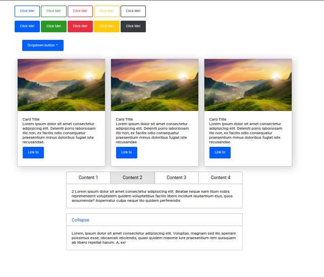
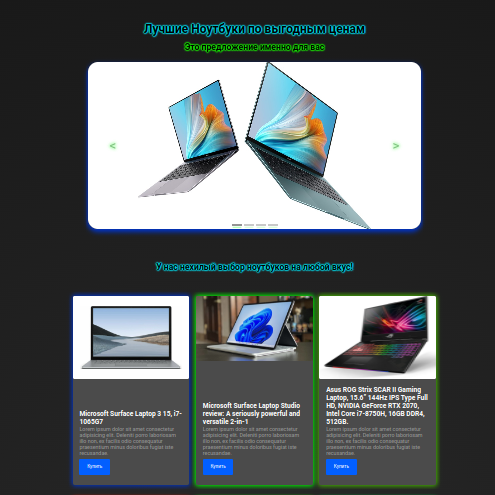

# My Custom UI Library

This is a custom UI library that I created for learning purposes. It's like a fusion of Bootstrap and jQuery, designed to help me explore web development concepts and have some fun along the way. While it's not as functional as the original libraries, it's a great learning exercise.

## Features

- Responsive design inspired by Bootstrap.
- Interactive elements powered by jQuery.
- Easy-to-use CSS classes for styling.

## Getting Started

### Installation

1. **Clone this repo**
1. **Install dependencies** `npm i`
1. **Build it with** `npx gulp`
1. `dist/script.js` **and** `dist/style.css` **are ready to use!**

## Example

You can find example project in [Testing](./testing_lib/) folder.

